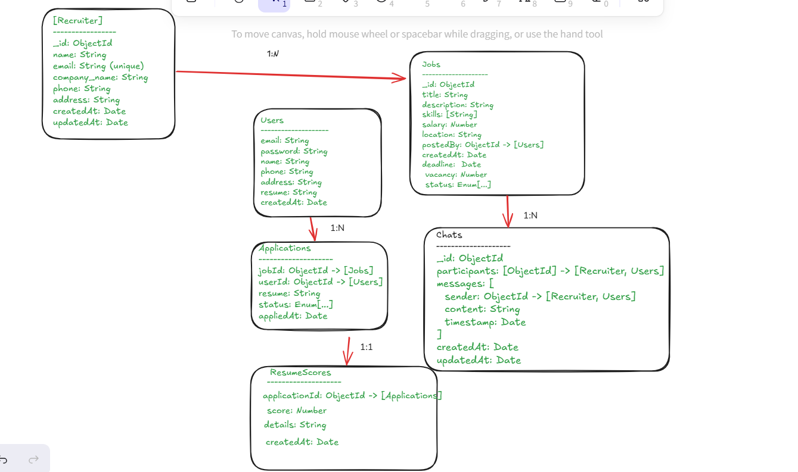

# JobConnect Backend

This is the backend service for the JobConnect platform, providing RESTful APIs for job seekers and recruiters to manage jobs, applications, chats, and resume scoring.

## Table of Contents

- [Features](#features)
- [Tech Stack](#tech-stack)
- [Project Structure](#project-structure)
- [Database Models](#database-models)
- [API Modules](#api-modules)
- [Setup & Running](#setup--running)
- [Environment Variables](#environment-variables)

---

## Features

- User and recruiter registration, authentication, and profile management
- Job posting and management by recruiters
- Job application by users
- Resume upload and AI-based resume scoring
- Chat system between users and recruiters
- JWT-based authentication and token blacklisting

## Tech Stack

- Node.js, Express.js
- MongoDB, Mongoose
- JWT for authentication
- Multer for file uploads
- Nodemailer for email
- Express-validator for validation

## Project Structure

```
backend/
│
├── app.js                # Express app setup and route mounting
├── server.js             # HTTP server entry point
├── package.json
├── .env
├── README.md
│
├── controllers/          # Route handlers (business logic)
│   ├── application.controller.js
│   ├── chat.controller.js
│   ├── job.controller.js
│   ├── recruiter.controller.js
│   ├── resumeScore.controller.js
│   └── user.controller.js
│
├── db/
│   └── db.js             # MongoDB connection logic
│
├── middlewares/
│   └── auth.js           # JWT authentication middleware
│
├── models/               # Mongoose schemas/models
│   ├── application.model.js
│   ├── blacklistToken.model.js
│   ├── chat.model.js
│   ├── job.model.js
│   ├── recruiter.model.js
│   ├── resumeScore.model.js
│   └── user.model.js
│
├── routes/               # Express route definitions
│   ├── application.routes.js
│   ├── chat.routes.js
│   ├── job.routes.js
│   ├── recruiter.routes.js
│   ├── resume.routes.js
│   └── user.routes.js
│
└── uploads/
    └── resumes/          # Uploaded resume files
```

## Database Models

The main entities and their relationships are:

- **User**: Job seeker, can apply to jobs and chat with recruiters.
- **Recruiter**: Can post jobs and chat with users.
- **Job**: Posted by a recruiter, can have multiple applications.
- **Application**: Created by a user for a job, has a 1:1 relationship with ResumeScore.
- **ResumeScore**: AI-generated score for an application.
- **Chat**: Between a user and a recruiter, contains messages.

See the ER diagram for details.

## API Modules

- **User APIs**: Registration, login, logout, profile, password reset ([routes/user.routes.js](routes/user.routes.js))
- **Recruiter APIs**: Registration, login, logout, profile, password reset ([routes/recruiter.routes.js](routes/recruiter.routes.js))
- **Job APIs**: CRUD for jobs ([routes/job.routes.js](routes/job.routes.js))
- **Application APIs**: Apply to jobs, manage applications ([routes/application.routes.js](routes/application.routes.js))
- **Resume Score APIs**: Generate and fetch resume scores ([routes/resume.routes.js](routes/resume.routes.js))
- **Chat APIs**: Create chat, send messages ([routes/chat.routes.js](routes/chat.routes.js))

## Setup & Running

1. **Install dependencies:**
   ```sh
   npm install
   ```

2. **Configure environment variables:**  
   Copy `.env.example` to `.env` and fill in the required values (see below).

3. **Start the server:**
   ```sh
   npm run server
   ```
   The server will run on `http://localhost:5000` by default.

## Environment Variables

Create a `.env` file in the backend folder with the following keys:

```
PORT=5000
MONGODB_URI=your_mongodb_connection_string
JWT_SECRET=your_jwt_secret
GMAIL_USER=your_gmail_address
GMAIL_PASS=your_gmail_app_password
NODE_ENV=development
```

## Notes

- Resume files are stored in `uploads/resumes/`.
- All API endpoints are prefixed (e.g., `/users`, `/jobs`, `/applications`, etc.).
- Authentication uses JWT in the `Authorization` header as `Bearer <token>`.
- See individual route files for detailed API endpoints.

---

For more details, see the code in the respective folders and files.